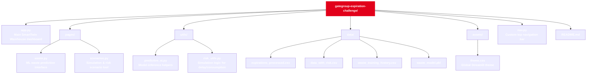

# Gategroup Expiration Challenge — SmartTwin for Food Freshness
## Overview
This project was developed for HackMTY 2025 under the track Pick & Pack of the Future – Expiration Date Management.
It proposes a digital twin for airline catering warehouses, integrating real-time monitoring, predictive modeling, and AI-powered analytics to automate expiration tracking and reduce food waste.

The solution addresses the challenge described by Gategroup, where catering teams manually verify expiration dates across thousands of items daily, often under time pressure. Our system automates this validation through data-driven intelligence, offering visibility, prediction, and proactive control of product freshness.

## Problem Context
In airline catering, every meal, snack, and beverage loaded on a flight must be verified to ensure it hasn’t expired. Currently, this is done manually — employees visually check printed dates on each product or LOT, a process that is repetitive, error-prone, and slow.

The lack of digital traceability leads to:
- Missed expired products reaching flights.
- Premature disposal of still-valid stock.
- Excess manual work with limited visibility.

The goal is to design a system that ensures freshness and food safety without slowing down operations, while minimizing waste and optimizing stock rotation

## Solution: SmartTwin Expiration Management

Our project — SmartTwin Warehouse — acts as a digital twin of the real warehouse, representing every LOT and product with live data streams and predictive analytics.

### Core Components

1. Real-Time Data Visualization
  - Interactive Streamlit dashboards built with Polars for performance.
  - Displays product status by freshness category: Expired, Critical (≤2 days), Medium (≤7 days), and OK.
  - Dynamic KPIs and visual distribution charts for instant insight.

2. Predictive AI Modeling
  - A Random Forest Classifier trained on mock Gategroup data (waste_training_history.csv) to predict product waste risk.
  - Inputs: Quantity, Days_to_Expire, Avg_Usage_per_Day, Risk.
  - Outputs: Waste_Label — 1 if likely wasted before use.

3. Simulation & Scenario Engine
  - Scenario dashboard for “what-if” analyses:
    - Flight delays (e.g., +12h). 
    - Consumption changes (e.g., 80% usage rate).
  - Recalculates risk scores dynamically using simulate_risk() to visualize potential waste.

4. SmartTwin Synchronization
- Warehouse “state” is refreshed automatically every 30 seconds (st_autorefresh).
- All computations and caches reset dynamically for live updates.

5. AI Retraining Pipeline
- A retraining button allows on-demand model updates (daily_train.py), automatically saving new versions of the .pkl model.

## Architecture


## Features
| Feature| Description |
|----------|:---------:|
| Auto-refresh dashboards | Updates every 30 seconds to reflect warehouse changes. | 
| Real-time expiration KPIs | Displays total lots, expired, critical, and medium-risk items. | 
| Dynamic filtering | Excludes zero-risk items while preserving counts in totals. | 
| Visual insights | Matplotlib charts for product distribution and expiry timelines. | 
|Interactive simulation | Allows “what-if” testing for flight delays and consumption rates. | 
|ML integration| Predicts risk of waste and enables retraining directly from the UI. | 


## Technical Stack
- Frontend: Streamlit
- Data Engine: Polars (replacing pandas for speed)
- Machine Learning: Scikit-learn RandomForestClassifier
- Visualization: Matplotlib
- Storage: Local CSV datasets simulating warehouse state
- Automation: Streamlit Autorefresh for live state updates

## Data Schema
| Feature| Description |
|----------|:---------:|
| Auto-refresh dashboards | Updates every 30 seconds to reflect warehouse changes. | 
| Real-time expiration KPIs | Displays total lots, expired, critical, and medium-risk items. | 
| Dynamic filtering | Excludes zero-risk items while preserving counts in totals. | 
| Visual insights | Matplotlib charts for product distribution and expiry timelines. | 
|Interactive simulation | Allows “what-if” testing for flight delays and consumption rates. | 
|ML integration| Predicts risk of waste and enables retraining directly from the UI. | 

## How to Run
1. Clone the repository
```bash
git clone https://github.com/rafabelts/gategroup-expiration-challenge.git
cd gategroup-expiration-challenge
```

2. Install dependencies
```bash
pip install -r requirements.txt
```

3. Run the app
```bash
streamlit run app.py
```

Access the dashboard at: http://localhost:8501

## Future Extensions

- Integration with computer vision scanning to detect expiry dates automatically.

- IoT-based smart bins/shelves for real-time LOT tracking.

- Deployment as a microservice API connected to ERP or inventory systems.

- Support for mobile scanning and barcode validation at dispatch.
